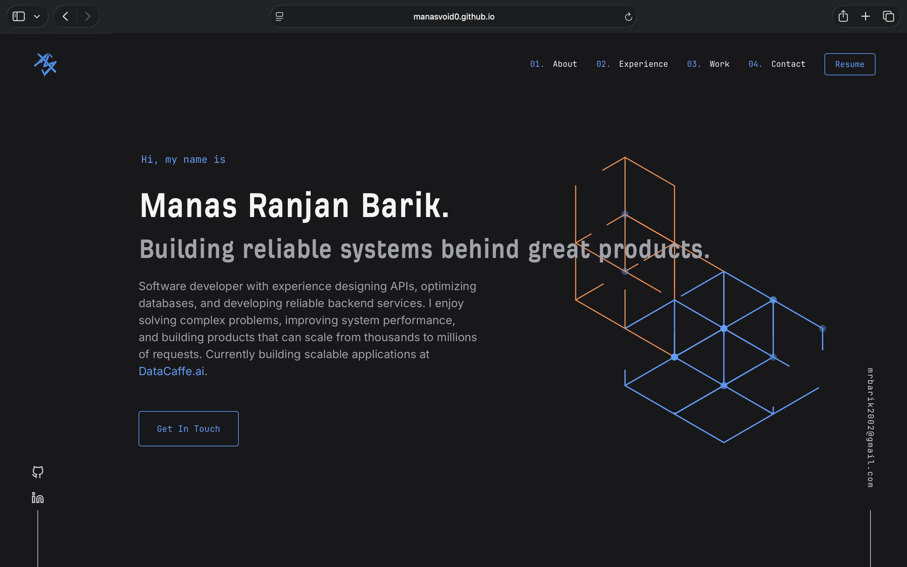

<div align="center">

# 🚀 Manas Ranjan Barik — Developer Portfolio

A fast, single-page developer portfolio built with **Vite + React** — dark-navy theme, green accent, and an animated isometric hero.

[](https://manasvoid0.github.io/PORTFOLIO/)
[](https://github.com/manasvoid0/PORTFOLIO/actions/workflows/deploy.yml)


**[🌐 View it live → manasvoid0.github.io/PORTFOLIO](https://manasvoid0.github.io/PORTFOLIO/)**

<br />



</div>

---

## ✨ Features

- ⚡ **Vite-powered** — instant dev server and an optimized production build
- 🎨 **Custom dark theme** — navy/zinc palette with a green accent and custom fonts (Incognito + GitLab Mono)
- 🧊 **Animated isometric hero** — hand-built SVG cube graphic
- 📜 **Reveal-on-scroll** — sections fade in via an `IntersectionObserver` hook
- 🧭 **Smart navbar** — hides on scroll-down, reappears on scroll-up, with a mobile menu
- 💼 **Tabbed experience** — job history with a sliding highlight
- 🗂️ **Content-driven** — all text lives in one `data.js` file; components stay presentational
- 🚀 **Auto-deploy** — every push to `main` ships to GitHub Pages via Actions

---

## 🛠️ Tech Stack

| Layer | Tools |
|---|---|
| **Framework** | React 18 |
| **Build tool** | Vite 5 |
| **Styling** | Plain CSS with CSS variables (`src/index.css`) |
| **Animation** | CSS transitions + `IntersectionObserver` |
| **Hosting** | GitHub Pages (GitHub Actions CI/CD) |

---

## 🏃 Getting Started

```bash
# 1. Clone
git clone https://github.com/manasvoid0/PORTFOLIO.git
cd PORTFOLIO

# 2. Install dependencies
npm install

# 3. Start the dev server  →  http://localhost:5173
npm run dev
```

### Other scripts

```bash
npm run build     # production build → dist/
npm run preview   # serve the built dist/ locally
```

---

## 🎨 Customize

| What | Where |
|---|---|
| **Content** (jobs, projects, socials, skills) | `src/data.js` |
| **Theme & fonts** (`--navy`, `--green`, font stacks) | top of `src/index.css` |
| **Hero graphic** | `src/components/IsoGraphic.jsx` |
| **Section copy** | the individual files in `src/components/` |

---

## 🚢 Deployment

Deployment is fully automated by [`.github/workflows/deploy.yml`](.github/workflows/deploy.yml):

1. Push to `main` (or trigger the workflow manually).
2. GitHub Actions runs `npm ci` → `npm run build`.
3. The `dist/` folder is published to **GitHub Pages**.

> ⚠️ The site is served from a sub-path, so `vite.config.js` sets `base: '/PORTFOLIO/'`. If you rename the repo, update that base path to match (it's case-sensitive).

---

## 📫 Connect

[](https://manasvoid0.github.io/PORTFOLIO/)
[](https://www.linkedin.com/in/manas-ranjan-barik-a2917927a/)
[](https://github.com/manasvoid0)
[](mailto:mrbarik2002@gmail.com)

<div align="center">
<sub>Built with ⚡ Vite + React · © Manas Ranjan Barik</sub>
</div>
